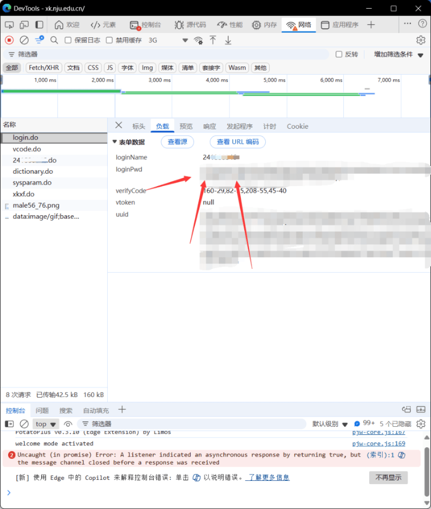
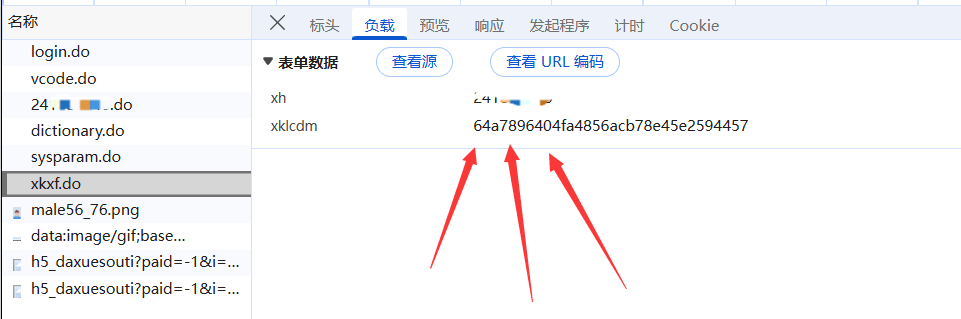
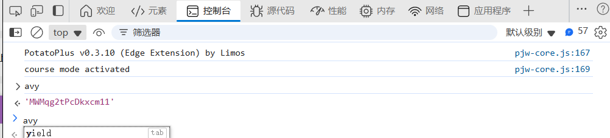

# 南京大学在线选课辅助脚本 (改进版)

这是一个用于南京大学在线选课系统的辅助脚本，旨在帮助同学们自动化监控和选择课程，减轻手动刷新的负担。

本项目基于 [lyc8503/NJUUtils](https://github.com/lyc8503/NJUUtils) 的开源代码进行了大量现代化改造，以适配当前选课系统的最新变化。

> **⚠️ 免责声明：**
> * 本项目仅供学习和技术交流使用，请勿用于非法用途。
> * 使用脚本选课存在一定的风险，包括但不限于账号安全问题、因请求频率过高被封禁、~~被辅导员敲门~~等。
> * **请严格遵守学校的选课规定**，任何因使用本项目而导致的学业问题或违规责任，作者概不负责。

---

## ✨ 主要改进

相较于原版项目，此版本主要进行了以下更新以适配 **2025秋季学期选课** 的南京大学选课系统：

1.  **适配最新登录接口**：重构了登录逻辑，移除了过时的请求参数。
2.  **支持新型点选验证码**：完全重写了验证码处理模块，手动点击完成点选验证，取代了旧版的图文识别。
3.  **破解抢课请求加密**：当前选课系统对最终的抢课请求（`volunteer.do`）的负载数据（`addParam`）增加了前端AES加密。本脚本已内置该加密算法，可以成功模拟浏览器行为发送有效请求。
4.  **集成Server酱通知**：增加了对 [Server酱](https://sct.ftqq.com/) 推送服务的支持，可以在抢课成功后第一时间发送微信通知，方便用户及时了解结果。

---

## 🚀 使用教程

### 1. 环境准备

确保你的电脑已经安装了 Python 3.8 或更高版本。建议使用conda。

### 2. 安装依赖

首先，将本项目下载或克隆到你的本地文件夹。文件夹中应包含 `grab.py` (你的脚本) 和 `requirements.txt` 文件。

打开命令行（终端），进入该文件夹，然后使用 pip 安装所有必需的第三方库：

```bash
# 进入脚本所在文件夹
cd path/to/your/script

# 安装依赖
pip install -r requirements.txt
```

### 3. 配置脚本

用代码编辑器打开你的Python脚本文件，找到顶部的 **配置区域**，并根据下面的指南修改其中的参数。

#### (1) 核心配置（必须修改）

* `STUDENT_NUMBER`: 你的学号，字符串格式。
    ```python
    STUDENT_NUMBER = "241880000"
    ```

* `ENCRYPTED_PASSWORD`: **加密后的密码**，而非你的登录密码原文。获取方式如下：
    1.  打开浏览器，登录南京大学网上办事大厅，进入**本科生选课系统**。
    2.  按 `F12` 打开开发者工具，切换到 **"网络" (Network)** 标签页。
    3.  在登录界面输入你的账号、密码和验证码，点击登录。
    4.  在网络请求列表中，找到一个名为 `login.do` 的请求，点击它。
    5.  在右侧窗口中，找到 **"负载" (Payload)** 或 **"载荷"** 标签页，其中有一个 `loginPwd` 字段，它后面的一长串大写字母和数字就是你的加密密码。复制这串值。
    

* `BATCH_CODE`: **选课批次代码**。获取方式如下：
    1.  成功登录选课系统后，保持开发者工具打开。
    2.  在网络请求列表中，找到一个名为 `xkxf.do` 的请求，点击它。
    3.  在右侧的 **"负载" (Payload)** 中，找到 `xklcdm` 字段，它对应的值就是当前的批次代码。复制它。
    

* `AES_KEY`: **抢课请求的加密密钥**。一般选课系统这种玩意十年不更新一次是不用改这个的，但是如果恩杰油突然改了，获取方式如下：
    1.  保持开发者工具打开，点进入选课系统，开始选课。
    2.  切换到 **"控制台" (Console)** 标签页。
    3.  在控制台里直接输入 `avy`，然后按回车。
    4.  控制台会返回一个16位的字符串，这就是AES加密密钥。复制它。
    

#### (2) 功能配置（可选，按需修改）

* `EXIT_ON_FIRST_SUCCESS`: 抢到一门课后是否立即退出脚本。默认为 `False` (否)，会继续监控收藏夹里的其他课程。如果只想抢一门最想要的课，可以设为 `True`。
* `FANTANG`: 是否启用Server酱通知。默认为 `False` (否)。
* `FANTANG_API`: Server酱的 `SendKey`。如果启用通知，需要在此填入你的 Key。
* `AT_LEAST_SLEEP`: 前一次请求（抢课、刷新等）之后，最少休息几秒，默认1s。
* `AT_MOST_SLEEP`: 前一次请求（抢课、刷新等）之后，最多休息几秒，默认2s。

### 4. 运行脚本

所有配置完成后，把你想要抢的课程加入你的收藏，在命令行中运行脚本：

```bash
python grab.py
```

### 5. 开始抢课

1.  脚本运行后，会首先下载验证码图片，并弹出一个名为 **"点击验证码"** 的窗口。
2.  根据图片下方的文字提示，**按顺序用鼠标左键**点击图片中的文字。
3.  如果你点错了，可以按键盘上的 `R` 键重置。
4.  点击满4次后，或手动按 `Enter` 键，验证码将自动提交。
5.  登录成功后，脚本会开始轮询你**网页收藏夹**中的课程列表。
6.  一旦发现有课程余量，脚本会自动加密并发送抢课请求。
7.  如果配置了Server酱，抢课成功后你会收到微信通知。

---

## ⏰ TODO

自动化验证码识别点击

## 📜 许可证

本项目基于原作者的 [MIT License](https://github.com/lyc8503/NJUUtils/blob/main/LICENSE) 开源。

## 🙏 致谢

* 感谢原作者 **[lyc8503](https://github.com/lyc8503)** 的开源项目为本项目提供了坚实的基础。
